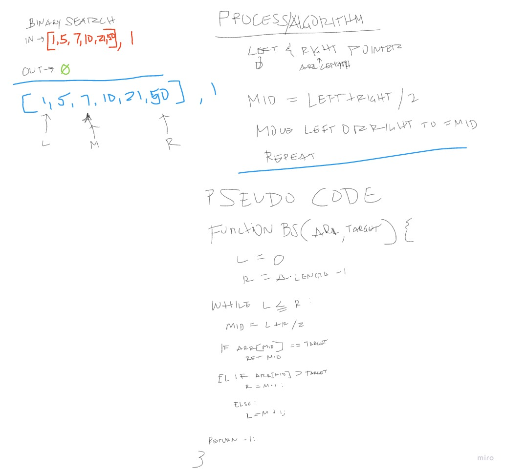

# Binary Search
<!-- Short summary or background information -->
Write a function that utilizes binary search algorithm.

## Challenge
<!-- Description of the challenge -->
Function that searches for target value through an array by using binary search algorithm and returning the array index of the target value.

Be careful of: empty arrays, arrays with only 1.

## Approach & Efficiency
<!-- What approach did you take? Why? What is the Big O space/time for this approach? -->

- Identify left and right pointer of the array.
- Enter while loop if left <= right.
- Identify middle of array by left + right / 2.
- If array value at middle equals to target return middle index.
- If arr at middle is greater than target value set right to middle - 1.
- if arr at middle is less than target value set left to middle + 1.
- Repeat until target is found or if left > right.
- Return -1 if target is not found.

## Solution
<!-- Embedded whiteboard image -->

