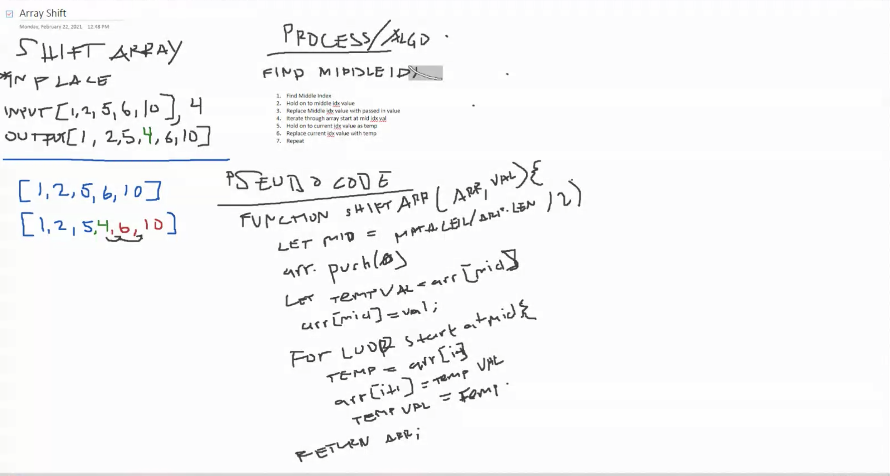

# Reverse an Array
<!-- Short summary or background information -->
Write a function that adds a value in middle of array.

## Challenge
<!-- Description of the challenge -->
Function that adds a value in the middle of array, then shifts the rest of array to the end.

Be careful of: empty arrays, arrays with only 1, odd numbered count, even numbered count.

## Approach & Efficiency
<!-- What approach did you take? Why? What is the Big O space/time for this approach? -->

- Identify middle index of arr.
- Swap middle index val with value passed in.
- Loops through the rest of arr starting at middle idx.
- Swap the rest of the arr value with the temp value each iteration.
- Return array.

## Solution
<!-- Embedded whiteboard image -->
;