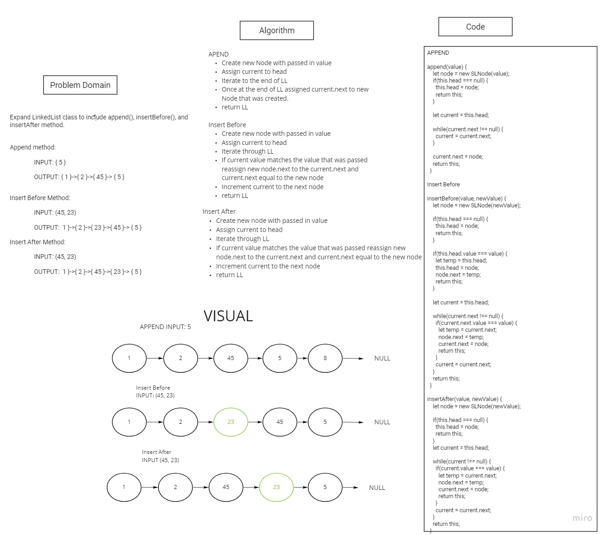
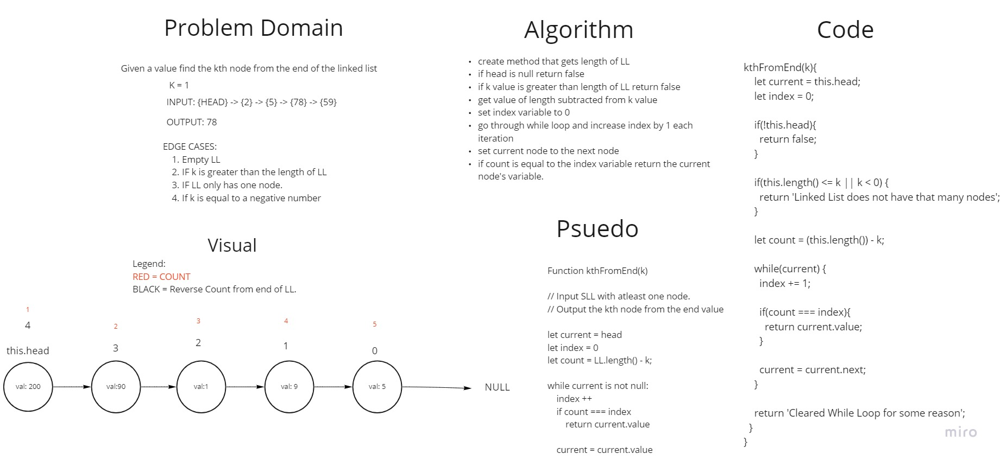

# Singly Linked List

Linked List is a sequence of Nodes that are connected/linked to each other. Each Node references the nest Node in the link.

## Challenge

Create a Node class and a LinkedList class that will work together to create a Linked List structure.

## Approach & Efficiency
<!-- What approach did you take? Why? What is the Big O space/time for this approach? -->
  - Create Node class with the value and next properties.
  - Create LinkedList class with the head property.
  - Inside LinkedList class create insert, includes, and toString method.
  - The insert method will take in a value as an argument and insert a new Node with this value in front of the current head.
  - The includes method will take in a value as an argument and checks the list if the value exists anywhere in the list.
  - The toString method will loop through the whole list and put all the node values found in a string and print when the loop has found the end of the loop.

## API
<!-- Description of each method publicly available to your Linked List -->
- `insert()` - insert a new Node in front of the list, reassigns new head to the new Node and assigns the old head to the next value of the new Node.
- `includes()` - checks the Linked List if the value passed in as an argument exists inside the list.
- `toString()` - prints out the whole Linked List in the console and returns a string with each node and its value.
- `append()` - insert a new Node with a value in the tail of the LinkedList.
- `insertBefore()` - takes in a value and newValue arguments, creates new node with newValue and inserts new node before the value.
- `insertAfter()` - takes in a value and newValue arguments, creates new node with newValue and inserts new node after the value.
- `delete()` - deletes the node with the value that is passed in as an argument.
- `length()` - returns the length of the Linked List;
- `kthFromEnd(k)` returns the value of the node from kth postion from the end.

## Solution

**Linked Insertions**

**kthFromEnd**

