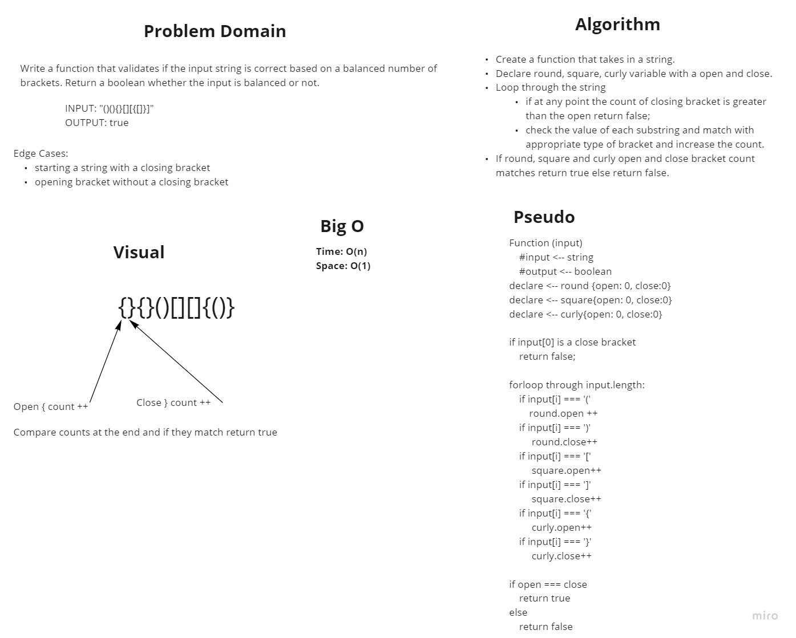

# Multi-Bracket-Validation

<!-- Short summary or background information -->

Write a function that validates if the input string is valid if the brackets are balanced.

## Challenge

<!-- Description of the challenge -->

Create a function that only takes in a string of round, square and curly brackets. Determine if the string is balanced based on the brackets. Return a boolean whether the input is balanced or not.

## Approach & Efficiency

<!-- What approach did you take? Why? What is the Big O space/time for this approach? -->

- Create a function that takes in a string.
- Declare round, square, curly variable with a open and close.
- Loop through the string
  - if at any point the count of closing bracket is greater than the open return false;
  - check the value of each substring and match with appropriate type of bracket and increase the count.
- If round, square and curly open and close bracket count matches return true else return false.

## Solution

<!-- Embedded whiteboard image -->

