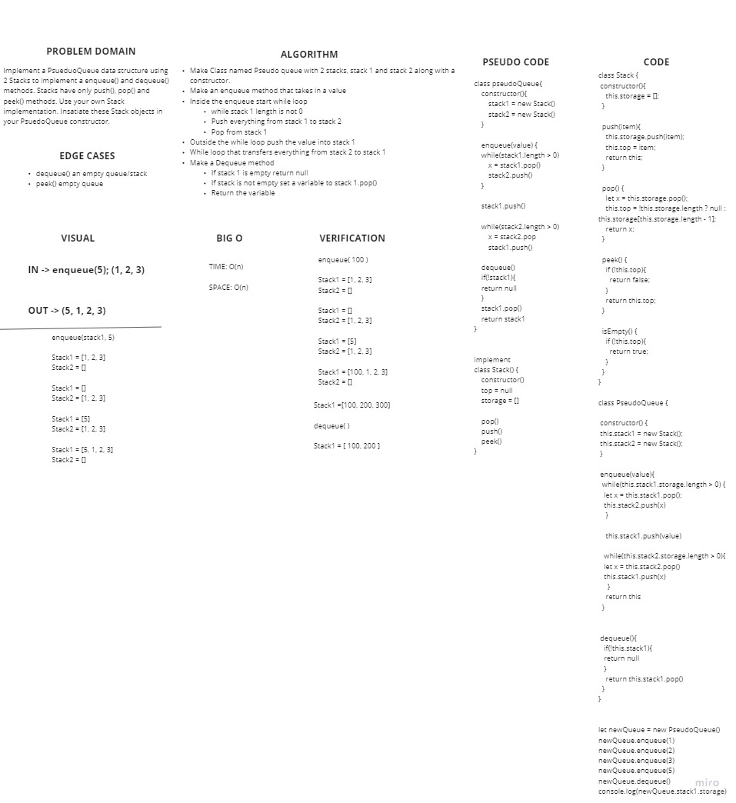

# Challenge Summary
<!-- Short summary or background information -->
Create a Queue data structure using 2 Stack objects.

## Challenge Description
<!-- Description of the challenge -->
Implement a PsueduoQueue data structure using 2 Stacks to implement a enqueue() and dequeue() methods. Stacks have only push(), pop() and peek() methods. Use your own Stack implementation. Insatiate these Stack objects in your PsuedoQueue constructor.

## Approach & Efficiency
<!-- What approach did you take? Why? What is the Big O space/time for this approach? -->
- Make Class named Pseudo queue with 2 stacks, stack 1 and stack 2 along with a constructor.
- Make an enqueue method that takes in a value
- Inside the enqueue start while loop
  - while stack 1 length is not 0
  - Push everything from stack 1 to stack 2
- Pop from stack 1
- Outside the while loop push the value into stack 1
- While loop that transfers everything from stack 2 to stack 1
  - Make a Dequeue method
  - If stack 1 is empty return null
  - If stack is not empty set a variable to stack 1.pop()
  - Return the variable

## Solution
<!-- Embedded whiteboard image -->
;
