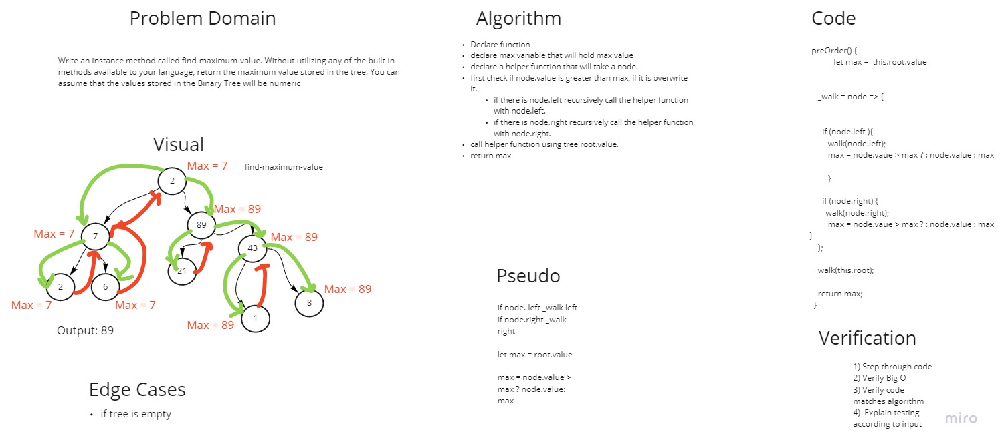
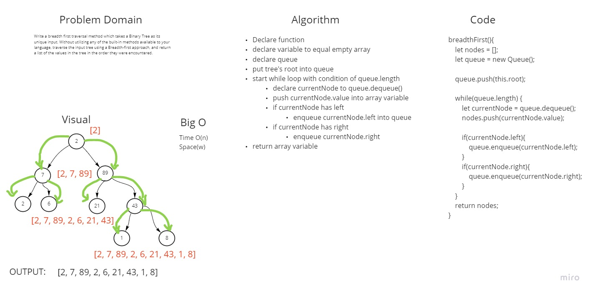

# Trees

<!-- Short summary or background information -->

Create a Binary Tree class that takes in Nodes to store data.

## Challenge

<!-- Description of the challenge -->

Add methods to the Binary Tree that traverses the depth of the tree.

Create a Binary Search Tree with an add method that traverses the tree and adds a new value based on binary search tree rules.
Additionally add a contains method that returns a boolean if the value exists in the tree.

## Approach & Efficiency

<!-- What approach did you take? Why? What is the Big O space/time for this approach? -->

- Create BinarySearchTree class that has add and contains method
- The add method takes in a value.
  - check if root is empty, then assigns new node to root if it is.
  - declare current to equal root.
  - declare a prev to null.
  - start while loop with condition of current != null.
  - set prev to current.
  - if value is less than current value, assign current to the left node.
  - if value is greater than current value, assign current to the right node.
  - once we exit while loop, we have found a leaf node.
  - check if value is less than prev.value and then assign the prev.left to the new node.
  - check if value is greater than prev.value and then assign the prev.right to the new node.
  - return the tree.
- The contains method takes in a value.
  - check if tree is empty then return false.
  - assign a variable to the this.preOrder() method available on the BinaryTree class.
  - check if value is included in what was return from preOrder() method.
  - return true or false if the value exist or not.

## API

<!-- Description of each method publicly available in each of your trees -->

- `add(value)` - adds a new node with the passed in value into the Binary Search Tree.
- `contains(value)` - checks the BinarySearch tree for the value and returns a boolean.
- `findMaxVal()` - returns largest value in the binary tree
- `breadthFirst()` - returns an array of values, in the order of breadth first.

## Solution

